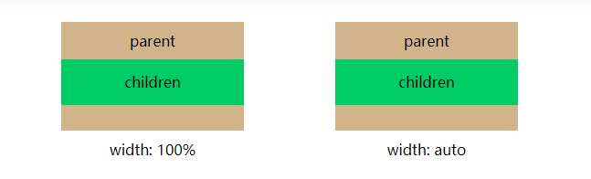
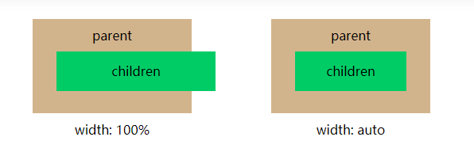

# width: 100%和width: auto有什么区别

> 块级元素有宽度width， 行内元素没有宽度width，所以只能在块级元素上验证两者区别

> 设置当前盒模型是IE盒模型

## 设置children元素margin: 0

如果设置children元素margin: 0时，那么它们之间好像没什么区别

## 设置children元素margin: 0 30px

如果设置children元素margin: 0 30px时，width: 100%的元素宽度不变，
位置向左偏移30px；width: auto的元素宽度变化，宽度 = 父元素宽度 - 左边margin - 右边margin，
并且向左偏移30px 

## 设置children元素margin: 0 -30px

如果设置children元素margin: 0 -30px时，width: 100%的元素宽度不变，位置向左偏移-30px；
width: auto的元素宽度变化，宽度 = 父元素宽度 - 左边margin - 右边margin，
并且向左偏移30px ，并且向左偏移-30px;

## width: auto可以配合display: flex实现如下布局

children设置display: flex和margin: 0 -30px，红色块设置flex-grow：1和margin: 0
 30px变成如下，间隔是60px的布局

在parent元素加上overflow: hidden后，变成

