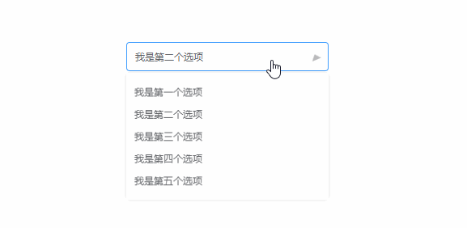

# 纯css实现高度不固定的下拉文本框的展开/收起的动画效果

> 最近看到团队的小伙伴，实现高度不固定的下拉文本框的展开/收起的动画效果时，
> 会涉及到javascript计算下拉框的高度，然后通过css设置高度的过渡效果实现动画，
> 并且在触发展开/收起时，也是通过javascript去监听document的click事件去处理，
> 我自己比较喜欢通过css去实现，如下效果：




- 利用css的transform: rotate(-90deg)旋转元素实现展开和收起
- 父元素设置tabindex属性，通过:focus选择器控制展开和收起

html:
```
<div class="select" tabindex="1">
  <div class="select-inner">我是个select</div>
  <div class="select-panel">
    <div class="select-option">我是第一个选项</div>
    <div class="select-option">我是第二个选项</div>
  </div>
</div>
```

### transform: rotate(-90deg)

因为高度不固定，通过过渡高度实现动画需要涉及javascript计算高度，所以用css的
transform：rotate(-90deg)可以达到相似的效果

```
.select-panel {
  transform: rotateX(90deg)
  transform-origin: center 0;
  transition: transform .2s;
}
```

### tabindex + :focus

tabindex属性可以让元素具有获取焦点的功能，点击元素后，元素获得焦点，就可以通过
:focus伪类选择器控制子元素的样式

```
.select:focus {
  .select-panel {
    transform: rotateX(0deg)
  }
}
```

### 完整代码，复制可用

```
// html：

<div class="select" tabindex="1">
  <div class="select-inner">我是个select</div>
  <div class="select-panel">
    <div class="select-option">我是第一个选项</div>
    <div class="select-option">我是第二个选项</div>
    <div class="select-option">我是第三个选项</div>
    <div class="select-option">我是第四个选项</div>
    <div class="select-option">我是第五个选项</div>
  </div>
</div>

// css:

.select {
  position: relative;
  width: 250px;
  font-size: 12px;
  color: #606266;
  outline: none;
  
  &:focus {
    .select-inner {
      border-color: #409eff;
      
      &::after {
        transform: rotateZ(180deg)
      }
    }
    
    .select-panel {
      transform: rotateX(0deg)
    }
  }
  
  .select-inner {
    width: 100%;
    height: 36px;
    line-height: 34px;
    padding: 0 30px 0 10px;
    border-radius: 4px;
    border: 1px solid #dcdfe6;
    outline: none;
    white-space: nowrap;
    overflow: hidden;
    text-overflow: ellipsis;
    cursor: pointer;
    
    &::after {
      content: '';
      position: absolute;
      top: 15px;
      right: 10px;
      border: 6px solid #bbb;
      border-top-width: 7px;
      border-bottom: none;
      border-left-color: transparent;
      border-right-color: transparent;
      transform: rotateZ(0deg)
      transform-origin: center center;
      transition: transform .2s;
    }
  }
  
  .select-panel {
    position: absolute;
    top: 100%;
    left: 0;
    margin-top: 2px;
    padding: 10px 0;
    width: 100%;
    border-radius: 4px;
    box-shadow: 0 0 8px 0 rgba(0, 0, 0, .1);
    transform: rotateX(90deg)
    transform-origin: center 0;
    transition: transform .2s;
    
    .select-option {
      padding: 6px 10px;
      cursor: pointer;
      
      &:hover {
        color: #fff;
        background-color: #409eff;
      }
    }
  }
}
```


